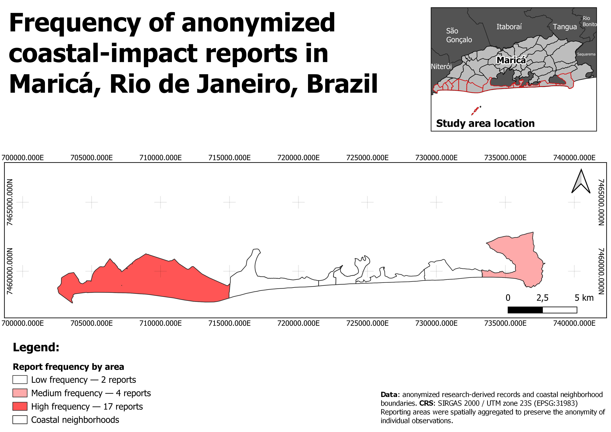
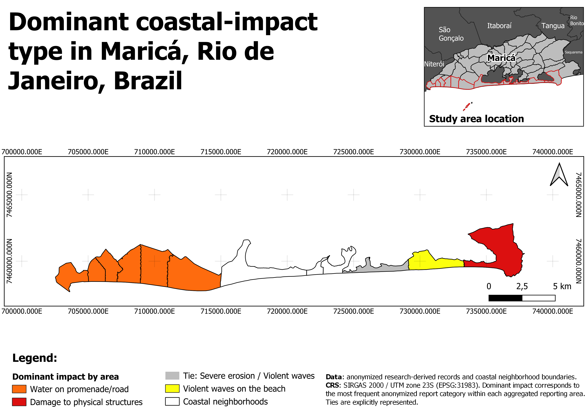
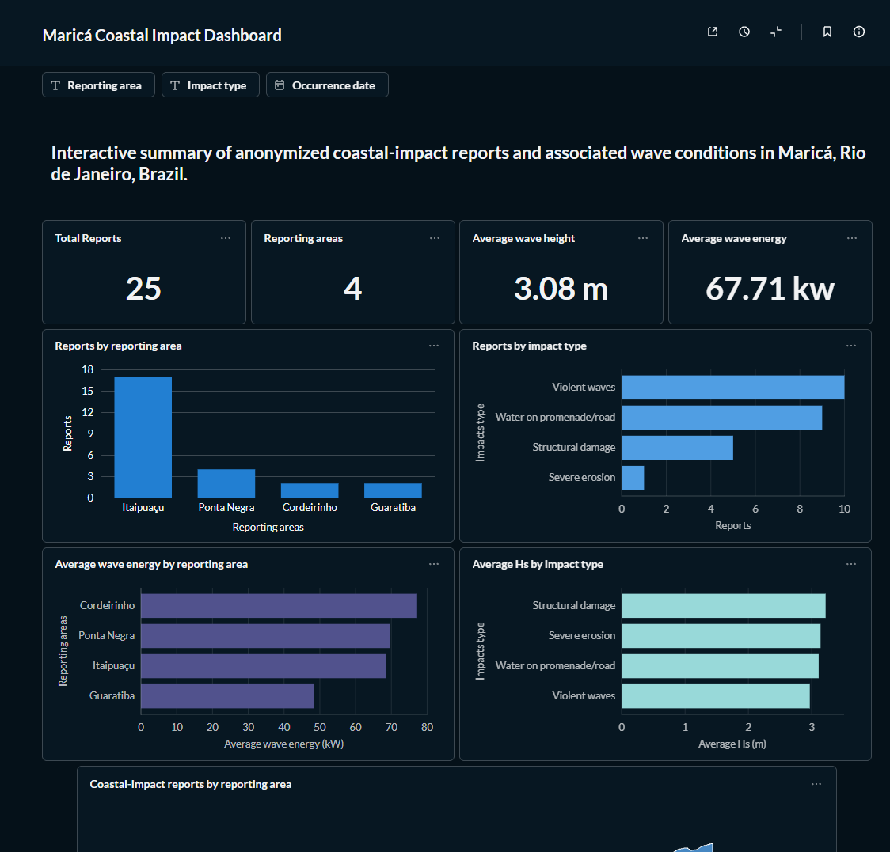
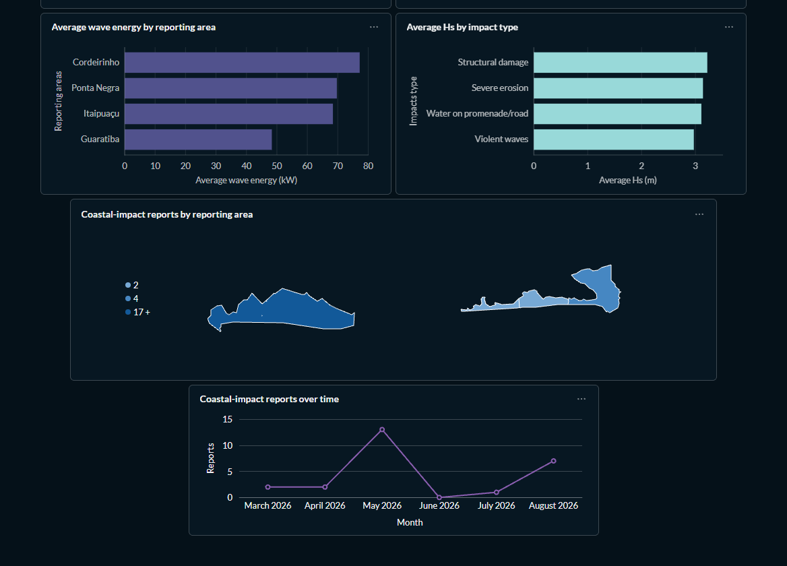

# Maricá Environmental Geospatial Data Platform

A reproducible geospatial data platform for managing, analyzing, and visualizing privacy-preserving coastal-impact reports and associated environmental conditions in Maricá, Rio de Janeiro, Brazil.

The project integrates Python ETL, PostgreSQL/PostGIS, QGIS, Docker, and Metabase. Its workflow covers data preparation, spatial aggregation, cartographic products, and an interactive dashboard.

[Dashboard](#interactive-metabase-dashboard) · [Maps](#qgis-cartographic-outputs) · [Database](#database-model) · [Reproduction](#reproducing-the-project) · [Author](#author)

## Project Overview

Coastal-impact observations may contain sensitive spatial and contextual information. This project demonstrates how research-derived environmental records can be transformed into a geospatial database while reducing disclosure risk through attribute removal, temporal generalization, and spatial aggregation.

The workflow:

1. Reads research-derived coastal-impact records.
2. Removes sensitive and unnecessary attributes.
3. Aggregates observations into generalized reporting areas.
4. Loads tabular and spatial datasets into PostgreSQL/PostGIS.
5. Creates analytical and spatial SQL views.
6. Produces cartographic outputs in QGIS.
7. Connects the database to Metabase for interactive analysis and visualization.

The public anonymized dataset contains 25 coastal-impact reports distributed across 4 aggregated reporting areas.

## Technology Stack

- Python
- pandas
- GeoPandas
- Shapely
- SQLAlchemy
- PostgreSQL/PostGIS
- Docker and Docker Compose
- QGIS
- Metabase
- GeoJSON

## Architecture

The project separates the workflow into four layers:

- **Data preparation:** Python-based anonymization and validation.
- **Data storage:** relational and spatial modeling in PostgreSQL/PostGIS.
- **Spatial analysis and cartography:** QGIS connected directly to PostGIS.
- **Interactive analytics:** Metabase connected to database views designed for dashboard consumption.

## Workflow

```text
Private research records          Coastal spatial data
          |                               |
          v                               v
 Python anonymization                 GeoJSON
          |                               |
          v                               |
Anonymized public CSV                   |
          |                               |
          +---------------+---------------+
                          |
                          v
                  PostgreSQL/PostGIS
                          |
                +---------+---------+
                |                   |
                v                   v
         Analytical views          QGIS
                |
                v
             Metabase
                |
                v
      Interactive dashboard
```

## Repository Structure

```text
environmental-geospatial-data-platform-marica/
|
├── data/
│   ├── private/                     # local only; excluded from Git
│   ├── sample/
│   │   └── vgi_reports_anonymized.csv
│   └── spatial/
│       ├── orla_marica.geojson
│       └── reporting_areas_wgs84.geojson
|
├── outputs/
│   ├── dashboard/
│   │   ├── dashboard_overview_01.png
│   │   └── dashboard_overview_02.png
│   └── maps/
│       ├── dominant_impact_by_area.pdf
│       ├── dominant_impact_by_area.png
│       ├── report_frequency_by_area.pdf
│       └── report_frequency_by_area.png
|
├── qgis/
│   └── environmental_gis_marica.qgz
|
├── sql/
│   ├── 01_schema.sql
│   ├── 02_tables.sql
│   ├── 03_indexes.sql
│   ├── 04_seed_data.sql
│   ├── 05_views.sql
│   └── 06_queries.sql
|
├── src/
│   ├── anonymize_vgi.py
│   ├── load_spatial_data.py
│   └── load_tabular_data.py
|
├── .env.example
├── .gitignore
├── docker-compose.yml
├── requirements.txt
└── README.md
```

`data/private/` is a local-only directory and is not included in cloned copies of the repository.

## Data Privacy and Anonymization

The original research dataset is not included in this repository. The public anonymized dataset was derived from research records and prepared specifically for demonstration and portfolio purposes.

The anonymization workflow removes or generalizes information that could expose individual observations, including:

- original record identifiers;
- exact coordinates and original geometries;
- precise timestamps;
- media URLs and free-text descriptions;
- internal research fields;
- potentially identifying social-media information.

Occurrence dates were reduced to monthly resolution. Original spatial observations were not published as individual points. Records were associated with generalized coastal reporting areas.

The public records contain these attributes:

```text
report_id
occurrence_month
neighborhood
impact_type
hs_m
tp_s
wave_direction_deg
wind_speed_kmh
wind_direction_deg
tide_m
cyclone_alert
wave_energy_kw
```

## Reporting Areas

The public dataset uses four aggregated reporting areas:

- Itaipuaçu
- Ponta Negra
- Cordeirinho
- Guaratiba

Some official neighborhood polygons were grouped into broader reporting areas to avoid introducing false spatial precision. For example, several official coastal neighborhoods are grouped under Itaipuaçu. The relationship is implemented in `coastal.neighborhood_groups`.

## Database Model

The PostGIS model contains four main tables:

| Table | Contents |
| --- | --- |
| `coastal.reports` | Privacy-preserving report metadata: `report_id`, `occurrence_month`, `neighborhood`, and `impact_type`. |
| `coastal.environmental_conditions` | Environmental variables associated with each report: `report_id`, `hs_m`, `tp_s`, `wave_direction_deg`, `wind_speed_kmh`, `wind_direction_deg`, `tide_m`, `cyclone_alert`, and `wave_energy_kw`. |
| `coastal.neighborhoods` | Coastal neighborhood polygons in SIRGAS 2000 / UTM zone 23S (EPSG:31983). |
| `coastal.neighborhood_groups` | Links official neighborhood polygons to generalized reporting areas. |

### Spatial Database Views

| View | Purpose |
| --- | --- |
| `v_reports_by_neighborhood` | Report frequency by reporting area. |
| `v_reports_by_impact` | Report frequency by impact category. |
| `v_impact_environment_summary` | Environmental conditions summarized by impact category. |
| `v_report_areas` | Aggregated reporting-area geometries created with PostGIS spatial operations. |
| `v_area_environment_summary` | Reporting-area geometries combined with environmental statistics. |
| `v_dominant_impact_by_area` | Most frequent impact category in each reporting area; ties are preserved. |
| `v_dashboard_kpis` | Summary indicators for the Metabase dashboard. |
| `v_dashboard_reports` | Dashboard fields, including English impact labels and monthly labels. |

### Spatial Operations

PostGIS aggregates official neighborhood geometries into reporting areas:

```sql
ST_Multi(
    ST_Union(n.geom)
)
```

Spatial indexes use GiST:

```sql
CREATE INDEX idx_neighborhoods_geom
ON coastal.neighborhoods
USING GIST (geom);
```

## Python ETL

### Anonymization

`src/anonymize_vgi.py` transforms the private research dataset into the public anonymized dataset. It selects approved records, removes sensitive attributes, generates anonymous report IDs, reduces temporal precision, preserves selected environmental variables, and exports a UTF-8 encoded CSV.

### Tabular Data Loader

`src/load_tabular_data.py` loads anonymized reports and environmental conditions into PostgreSQL. It validates expected columns, duplicate report IDs, allowed reporting areas, record counts, and relationships between reports and environmental conditions.

### Spatial Data Loader

`src/load_spatial_data.py` loads coastal neighborhood polygons into PostGIS. It validates the expected feature count, coordinate reference system, null and invalid geometries, geometry type, and PostGIS SRID. Geometries are stored as `MULTIPOLYGON` in EPSG:31983.

## QGIS Cartographic Outputs

QGIS connects directly to the PostGIS database. The project includes two maps:

- **Frequency of anonymized coastal-impact reports:** number of reports associated with each reporting area.
- **Dominant coastal-impact types:** most frequent impact category in each area, with tied categories represented.

The maps are saved as PNG and PDF files in `outputs/maps/`.

### Report Frequency by Reporting Area



### Dominant Coastal-Impact Type by Reporting Area



## Interactive Metabase Dashboard

Metabase connects directly to the PostGIS database. The dashboard includes total reports, reporting-area count, average significant wave height, average wave energy, reports by area and impact type, average wave energy by area, average significant wave height by impact type, spatial distribution of reports, and monthly report frequency.

Interactive filters cover reporting area, impact type, and occurrence date. Dashboard screenshots are stored in `outputs/dashboard/`.

### Dashboard Overview





> The interactive dashboard runs locally through Docker and is therefore not publicly hosted. Screenshots of the final dashboard are included below.

### Custom Metabase Map

A simplified WGS 84 GeoJSON was generated for the Metabase region map: `data/spatial/reporting_areas_wgs84.geojson` (EPSG:4326). The `report_area` field serves as both the region identifier and display field.

The [public GeoJSON](https://raw.githubusercontent.com/Camilaamerico/environmental-geospatial-data-platform-marica/main/data/spatial/reporting_areas_wgs84.geojson) is hosted in the repository.

### Dashboard Summary

| Indicator | Value |
| --- | ---: |
| Reports | 25 |
| Reporting areas | 4 |
| Average significant wave height | 3.08 m |
| Average wave energy | 67.71 kW |

| Impact category | Reports |
| --- | ---: |
| Violent waves | 10 |
| Water on promenade/road | 9 |
| Structural damage | 5 |
| Severe erosion | 1 |

These values describe the public anonymized portfolio dataset. They do not represent a complete inventory of coastal impacts in Maricá.

## Skills Demonstrated

This project demonstrates practical experience with:

- relational and spatial database design;
- PostgreSQL/PostGIS administration;
- spatial SQL and geometry aggregation;
- Python-based ETL and data validation;
- handling CRS and spatial data interoperability;
- privacy-aware geospatial data publishing;
- QGIS/PostGIS integration;
- environmental data analysis;
- Dockerized development environments;
- interactive dashboard development;
- reproducible geospatial workflows.

## Reproducing the Project

> The commands below assume the default database name and user provided in `.env.example`. If these values are changed, update the corresponding commands accordingly.

### 1. Clone the repository

```powershell
git clone https://github.com/Camilaamerico/environmental-geospatial-data-platform-marica.git
cd environmental-geospatial-data-platform-marica
```

### 2. Create the environment file

Copy `.env.example` to `.env` and define local PostgreSQL credentials. For example:

```dotenv
POSTGRES_DB=environmental_gis
POSTGRES_USER=postgres
POSTGRES_PASSWORD=your_password
```

The `.env` file is excluded from version control.

### 3. Start Docker services

```powershell
docker compose up -d
```

This starts PostgreSQL/PostGIS at `localhost:5432` and Metabase at `http://localhost:3000`.

### 4. Create the Python environment

In Windows PowerShell:

```powershell
py -m venv .venv
.\.venv\Scripts\python.exe -m pip install -r requirements.txt
```

### 5. Configure database variables for Python

The Python loaders accept database connection information through environment variables. Use the same credentials defined in `.env`:

```powershell
$env:DB_HOST="localhost"
$env:DB_PORT="5432"
$env:DB_NAME="environmental_gis"
$env:DB_USER="postgres"
$env:DB_PASSWORD="your_password"
```

### 6. Create the PostGIS schema and tables

Copy and execute the SQL scripts:

```powershell
docker cp sql\01_schema.sql marica_postgis:/tmp/01_schema.sql
docker exec -it marica_postgis psql -U postgres -d environmental_gis -f /tmp/01_schema.sql

docker cp sql\02_tables.sql marica_postgis:/tmp/02_tables.sql
docker exec -it marica_postgis psql -U postgres -d environmental_gis -f /tmp/02_tables.sql

docker cp sql\03_indexes.sql marica_postgis:/tmp/03_indexes.sql
docker exec -it marica_postgis psql -U postgres -d environmental_gis -f /tmp/03_indexes.sql
```

Using `docker cp` followed by `psql -f` also avoids character-encoding problems with accented place names on Windows terminals.

### 7. Load spatial data

```powershell
.\.venv\Scripts\python.exe src\load_spatial_data.py
```

The loader imports coastal polygons into `coastal.neighborhoods`.

### 8. Create reporting-area relationships

```powershell
docker cp sql\04_seed_data.sql marica_postgis:/tmp/04_seed_data.sql
docker exec -it marica_postgis psql -U postgres -d environmental_gis -f /tmp/04_seed_data.sql
```

### 9. Load anonymized tabular data

```powershell
.\.venv\Scripts\python.exe src\load_tabular_data.py
```

The expected public anonymized dataset contains 25 reports.

### 10. Create analytical views

```powershell
docker cp sql\05_views.sql marica_postgis:/tmp/05_views.sql
docker exec -it marica_postgis psql -U postgres -d environmental_gis -f /tmp/05_views.sql
```

### 11. Run validation queries

```powershell
docker cp sql\06_queries.sql marica_postgis:/tmp/06_queries.sql
docker exec -it marica_postgis psql -U postgres -d environmental_gis -f /tmp/06_queries.sql
```

## Connecting QGIS

Create a PostgreSQL connection with host `localhost`, port `5432`, database `environmental_gis`, and schema `coastal`. The QGIS project is available at `qgis/environmental_gis_marica.qgz`.

## Connecting Metabase

Open `http://localhost:3000`. When configuring the PostgreSQL connection from inside the Metabase container, use host `db`, port `5432`, and database `environmental_gis`. The username and password must match `.env`. The Metabase container must use `db` as the database host.

### Metabase Reproducibility Note

The database scripts, SQL views, spatial data, and custom GeoJSON required by the dashboard are version-controlled in the repository. The Metabase application configuration is stored in its Docker volume and is not currently provisioned automatically from source control. The included screenshots document the dashboard configuration.

## Data Limitations

This repository contains a privacy-preserving public dataset derived from research records. The observations are not a systematic census of coastal impacts. Spatial locations were generalized, dates were reduced to monthly resolution, and the public dataset should not be used to reconstruct individual observations. Reported frequencies describe the available public records rather than all coastal hazards in Maricá.

## Author

Camila Américo dos Santos  
Environmental Scientist  
PhD in Marine Biology and Coastal Environments  
GIS, Remote Sensing and Geospatial Data Science

[GitHub](https://github.com/Camilaamerico) · [ORCID](https://orcid.org/0000-0003-3286-3428)
